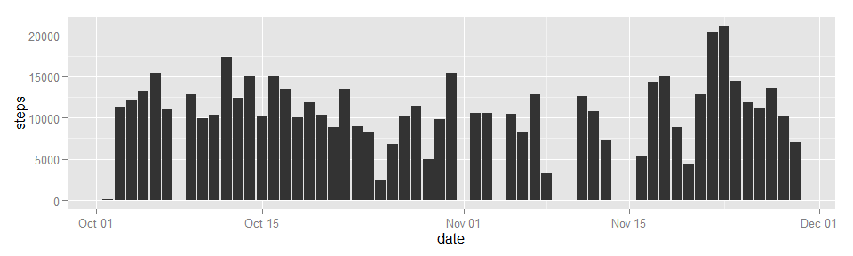
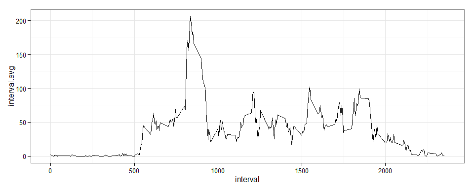
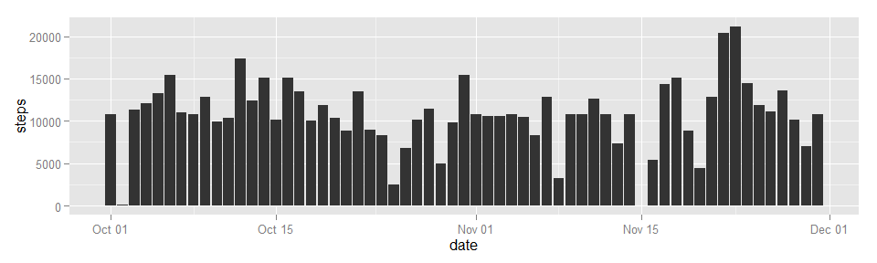
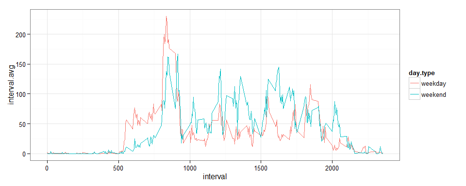

<h2 style="text-align:center">Reproducible Research - Assignment 1</h2>

<br/><h4>Import R packages</h4>


```r
library(ggplot2)
library(dplyr)
```

<br/><h4>Loading and preprocessing the data</h4>


```r
dat  = read.csv('activity.csv', colClasses = c('integer','Date','integer'))
dat0 = tbl_df(dat)
head(dat,3)
```

```
##   steps       date interval
## 1    NA 2012-10-01        0
## 2    NA 2012-10-01        5
## 3    NA 2012-10-01       10
```

<br/><h4>What is mean total number of steps taken per day?</h4>

<b>Make a histogram of the total number of steps taken each day</b>

```r
qplot(date, steps,data = na.omit(dat), geom="bar", stat ="identity",na.rm=TRUE) + theme_gray()
```

 

<hr/>

<b>Calculate and report the mean and median total number of steps taken per day</b>


```r
dat1 = dat0 %>% group_by(date) %>% 
     summarize(Steps.Per.Day = sum(steps,na.rm = FALSE))

median(dat1$Steps.Per.Day,na.rm=TRUE)
```

```
## [1] 10765
```

```r
mean(dat1$Steps.Per.Day,na.rm=TRUE)
```

```
## [1] 10766
```

<br/><h4>What is the average daily activity pattern?</h4></b>

<b>Make a time series plot of the 5-minute interval and the average number of steps taken, averaged across all days</b>

```r
dat2 = dat0 %>% group_by(interval) %>% 
     summarize(interval.avg = mean(steps,na.rm = TRUE))
qplot(interval,interval.avg,data=dat2,geom="line") + theme_bw()
```

 

<b>Which 5-minute interval, on average across all the days in the dataset, contains the maximum number of steps?</b>


```r
maxStepAvg = max(dat2$interval.avg)
dat2 %>% filter(interval.avg == maxStepAvg)
```

```
## Source: local data frame [1 x 2]
## 
##   interval interval.avg
## 1      835        206.2
```

<br/><h4>Calculate and report the total number of missing values in the dataset</h4></b>
<b>Calculate and report the total number of missing values in the dataset</b>


```r
# NA count = Total row count - non NA count
nrow(dat) - nrow(na.omit(dat))
```

```
## [1] 2304
```

<b>Create a new dataset that is equal to the original dataset but with the missing data filled in</b>


```r
# Replace NA values with their interval averages
dat3 = dat0 %>% left_join(dat2,by="interval") %>%
     mutate(steps = ifelse(is.na(steps),interval.avg,steps))
head(dat3,3)
```

```
## Source: local data frame [3 x 4]
## 
##   interval  steps       date interval.avg
## 1        0 1.7170 2012-10-01       1.7170
## 2        5 0.3396 2012-10-01       0.3396
## 3       10 0.1321 2012-10-01       0.1321
```

<b>Reproduce the first part of the assignment with the new data</b>


```r
qplot(date, steps,data = dat3, geom="bar", stat ="identity") + theme_gray()
```

 

```r
dat4 = dat3 %>% group_by(date) %>% 
     summarize(Steps.Per.Day = sum(steps))

median(dat4$Steps.Per.Day)
```

```
## [1] 10766
```

```r
mean(dat4$Steps.Per.Day)
```

```
## [1] 10766
```

It is clear that the added data has significant impacts on the graph. However, there is little to no change in the median and mean numbers (as expected) since the NA values were replaced with appropriate average of similar intervals.


<br/><h4>Are there differences in activity patterns between weekdays and weekends?</h4>
<b>Create a new factor variable in the dataset with two levels – “weekday” and “weekend” indicating whether a given date is a weekday or weekend day:</b>

```r
dat5 = dat3[,1:3] %>% mutate(
     day.type = ifelse(weekdays(date) %in% c("Sunday","Saturday"),
     "weekend","weekday"))
head(dat5,3)
```

```
## Source: local data frame [3 x 4]
## 
##   interval  steps       date day.type
## 1        0 1.7170 2012-10-01  weekday
## 2        5 0.3396 2012-10-01  weekday
## 3       10 0.1321 2012-10-01  weekday
```

<b>Make a panel plot containing a time series plot of the 5-minute interval and the average number of steps taken, averaged across all weekday days or weekend days.</b>


```r
dat6 = dat5 %>% group_by(day.type,interval) %>% summarise(interval.avg = mean(steps))
qplot(interval,interval.avg,data=dat6,geom="line",color=day.type) + theme_bw()
```

 
